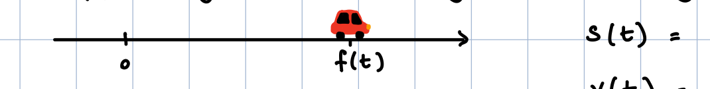
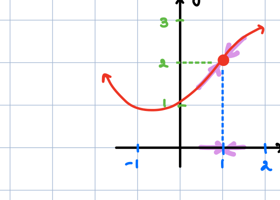
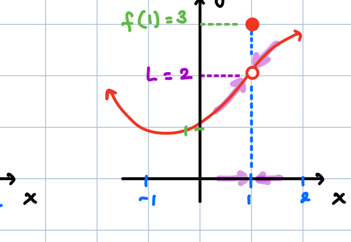
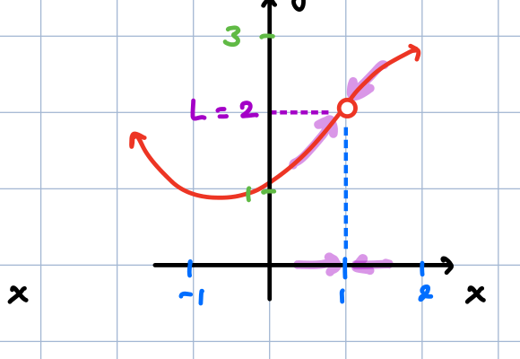
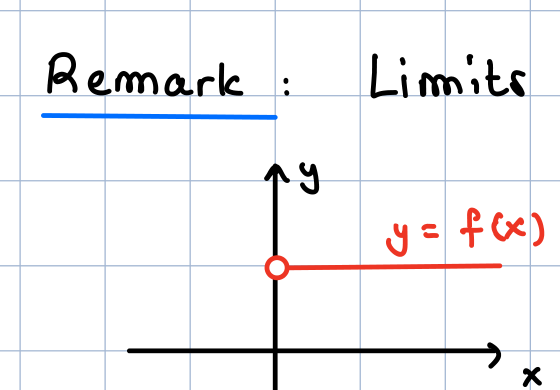
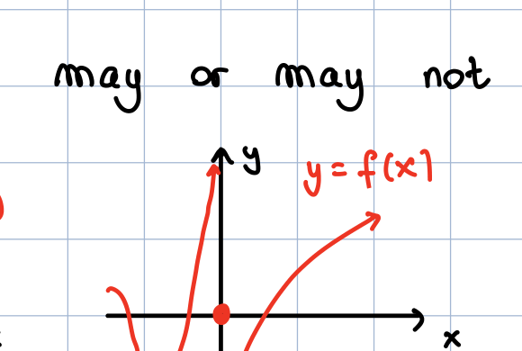
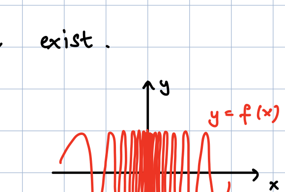
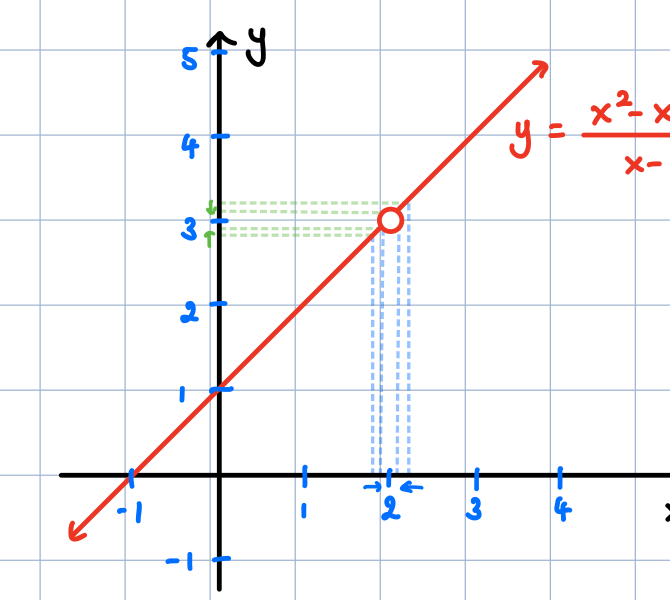
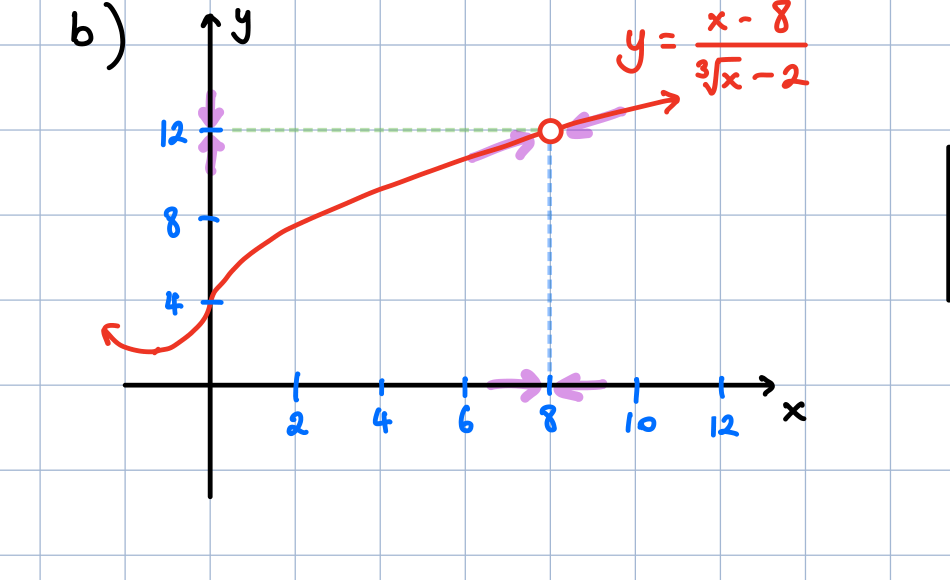

# Graph Images

This document embeds and links the graphs found in the workspace.

- Note: images are referenced relative to this file's location.

## Graphs

1. **Driving**  
     
   [Open image](graph_01_driving.png)

2. **Limit — continuous**  
     
   [Open image](graph_02_limit_continuous.png)

3. **Limit — hole/value difference**  
     
   [Open image](graph_03_limit_hole_value_diff.png)

4. **Limit — hole**  
     
   [Open image](graph_04_limit_hole.png)

5. **Jump**  
     
   [Open image](graph_05_jump.png)

6. **Vertical asymptote**  
     
   [Open image](graph_06_vertical_asymptote.png)

7. **Infinite oscillation**  
     
   [Open image](graph_07_infinite_oscillation.png)

8. **Linear with hole**  
     
   [Open image](graph_08_linear_with_hole.png)

9. **Cube root curve**  
     
   [Open image](graph_09_cube_root_curve.png)

---

If you want different captions or ordering, tell me which names to use and I'll update the files.